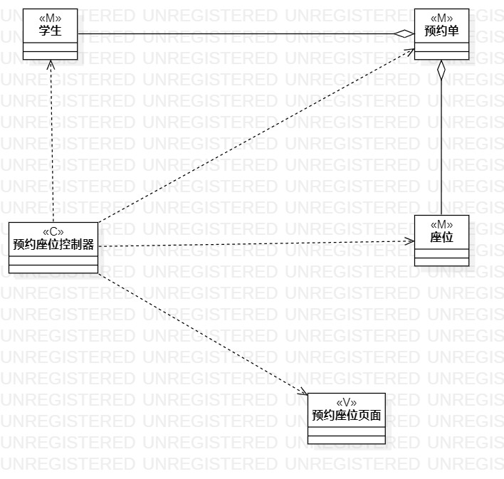

# 实验四、五：类建模和高级类建模

## 一、实验目标

1. 掌握类建模方法；
2. 了解MVC或熟悉的设计模式；
3. 掌握类图的画法；（Class Diagram）
4. 理解类的5种关系；
5. 掌握类之间关系的画法。（Class Diagram）

## 二、实验内容

1. 学习类图概念；
2. 学习类图画法；
3. 根据实验二中的用例规约创建类图。

## 三、实验步骤

1. 创建录入座位信息的类图；
2. 创建三个类，分别是录入座位信息控制器、座位和录入座位信息页面；
3. 然后给录入座位信息控制器与座位、录入座位信息页面添加依赖关系（Dependency）；
4. 创建修改座位信息的类图；
5. 创建三个类，分别是修改座位信息控制器、座位和修改座位信息页面；
6. 然后给修改座位信息控制器与座位、修改座位信息页面添加依赖关系（Dependency）；
7. 创建预约座位的类图；
8. 创建六个类，分别是预约座位控制器、学生、座位、预约时间、预约单和预约座位页面；
9. 然后给预约座位控制器与学生、座位、预约时间、预约单和预约座位页面添加依赖关系（Dependency）；
10. 最后给预约单与学生、座位和预约时间添加聚合关系（Aggregation）。

## 实验结果

   
图1：录入座位信息的类图

   
图2：修改座位信息的类图

   
图3：预约座位的类图
